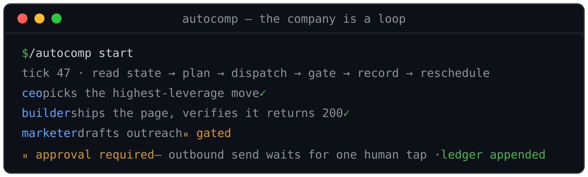

<p align="center">
  <a href="https://autocomp.limed.tech">
    
  </a>
</p>

<h1 align="center">autocomp</h1>

<p align="center">
  <strong>Run an autonomous company as a tick loop inside Claude Code.</strong><br/>
  <sub>Role subagents · tool playbooks · hard approval gates · an append-only ledger.<br/>
  Your keys, your repo — no platform in the middle, no revenue share.</sub>
</p>

<p align="center">
  <a href="https://github.com/Eastkap/autocomp/stargazers"></a>
  <a href="LICENSE"></a>
  <a href="https://github.com/Eastkap/autocomp/commits/main"></a>
  <a href="https://claude.com/claude-code"></a>
</p>

<p align="center">
  <a href="https://autocomp.limed.tech/live"></a>
  <a href="https://autocomp.limed.tech"></a>
  <a href="https://brief.limed.tech"></a>
</p>

---

Most "AI runs your company" products come in one of two bad shapes:

- a hosted platform that hides where the human actually sits in the loop — and takes a cut of what "your" company earns
- a black box that spends money and messages people under your name

autocomp is the opposite. It's a **thin, open framework** that runs a company as a tick loop
inside Claude Code — no OpenClaw, no Hermes, no Suna to self-host. The "AI workforce" is just
**role prompts + tool playbooks + a heartbeat**, built entirely from primitives Claude Code
already ships:

| Capability (the platforms wrap this) | autocomp uses |
|---|---|
| The agent "squad" | `Agent` subagents driven by `roles/*.md` |
| The heartbeat / always-on loop | `/loop`+`ScheduleWakeup`, `/goal`, or cron |
| Memory | `private/memory/` files |
| Immutable audit log + replay | append-only `private/state/ledger.md` (git-tracked) |
| Approval gates | `private/state/approvals.md` + `AskUserQuestion` + a phone push |
| Secrets vault (path, not value) | gitignored `.env`, referenced by name |
| Commerce / ads / outreach (the OSS gap) | `tools/stripe.md`, `tools/ads.md`, `tools/outreach.md` |

**Watch it run for real:** [autocomp.limed.tech/live](https://autocomp.limed.tech/live) streams
events straight from the actual loop's ledger — including the ticks that shipped nothing and
the mistakes it made and fixed. It is not a marketing reel.

See [`whitepaper.md`](whitepaper.md) for the competitive landscape and why this is the native
port, and [`inspiration.md`](inspiration.md) for the tooling stack + principle sources.

---

## How a tick works

One tick = one heartbeat. A fresh `claude -p` process fires, does exactly this, and exits —
so every tick's token cost is measured, per venture:

```
       ┌────────────────────────────── one tick ──────────────────────────────┐
       │                                                                      │
state ─▶ plan (CEO role) ─▶ dispatch role subagents ─▶ record ─▶ report ─▶ reschedule
       │        │                     │                   │                    │
       │   scoreboard:          builder · marketer    append-only              │
       │   funnel + burn        analyst · cfo         ledger.md                │
       │   vs income                  │                                        │
       │                   spends money? sends outbound? destructive?          │
       │                              │                                        │
       │                  ⏸  APPROVAL GATE — writes PENDING, pushes            │
       │                      to the owner's phone, and WAITS                  │
       └──────────────────────────────────────────────────────────────────────┘
```

The company's constitution — every principle and hard rule the loop obeys each tick — is one
readable file: [`CLAUDE.md`](CLAUDE.md).

## The safety model is the point

- **Money, outbound sends, the owner's personal identity, and destructive actions can never
  execute inside a tick.** They land in `approvals.md` as `PENDING`, push to the owner's
  phone, and wait for an explicit yes.
- **The ledger is append-only.** Decisions, dispatches, results, spend — recorded and never
  edited. The public [live feed](https://autocomp.limed.tech/live) is generated from it.
- **No invented numbers.** A standing hard rule: if a tool didn't run or a metric wasn't
  measured, the loop says so. A failing test is a result to report, not to hide.
- **Secrets stay named, never inlined.** Keys live in a gitignored `.env` and are referenced
  by name; a missing key turns the dependent step into a gated/manual action instead of a lie.

## What's in the box

```
CLAUDE.md          the constitution — principles + hard safety rules (read this first)
roles/             CEO, builder, marketer, sales, analyst, cfo   (the org chart)
tools/             deploy, stripe, ads, outreach, GSC, kanban…   (how roles act safely)
kanban/            shared task board (Supabase + static page) — the human's work queue
agent-worker/      worker 2: agentic browser on your homelab (drives a real logged-in profile)
trawl-worker/      worker 1: residential-IP CAPTCHA/bot-wall solver (pull queue)
browser/           Playwright + Camoufox helpers for fetching like a human
.claude/           the autocomp-tick, /ceo, next-move… skills + /autocomp command
private.example/   the scaffold for a venture — copied to private/ on init
private/           YOUR live venture (gitignored, never committed):
  charter.md         the company definition (the "one prompt")
  state/             ledger (audit) · pnl · backlog · kpis · approvals
  memory/            durable learnings that compound across ticks
  site/              the product the loop builds and deploys
```

The framework (everything above `private/`) is the open-source part. `private/` is your
company's live data and never leaves your machine.

## Quick start

```bash
git clone https://github.com/Eastkap/autocomp.git && cd autocomp
tools/init.sh        # scaffolds private/ + .env, checks prereqs, prints next steps
```

1. Edit `private/charter.md` — your venture, ICP, budget, and a verifiable **Definition of
   success**. Fill whatever keys you have in `.env` (missing keys degrade to gated/manual
   steps — nothing breaks, nothing is faked).
2. Open Claude Code in the repo and run the loop:

| Command | What it does |
|---|---|
| `/autocomp start` | run tick 1 and schedule the heartbeat |
| `/autocomp goal` | run until the charter's Definition of success holds |
| `/autocomp resume` / `stop` | pick the loop back up / halt it |
| `/ceo` | one interactive pass: triage the whole board, execute the best move |

For 24/7 unattended operation, a system cron fires `tools/tick.sh` hourly (it gates itself
to ~one real tick per ~5h and logs measured token cost per tick) — see `tools/loop.md`.

## Loop drivers (pick one)

- **`/loop` + `ScheduleWakeup`** — interval heartbeat; good for steady, attended runs.
- **`/goal`** — run until a verifiable end state (e.g. "first paying customer"). Give it
  success criteria and watch it go.
- **cron** — unattended daily/hourly cadence; the VPS default.

## Honest status

The loop, roles, gates, ledger, kanban, and approval flow are real and run 24/7 on a VPS.
Web research, deploys, Search Console indexing, directory submissions, and the two homelab
workers are live. Stripe/ads/outreach are real playbooks that execute once their keys exist
and the human approves — until then they surface as gated/manual steps. What it deliberately
isn't: "type a prompt, get a business while you sleep." A human approves every dollar and
every outbound message. That's the point.

## Proof: live ventures

- **[Weekly Brief](https://brief.limed.tech)** — turns a newsletter firehose into one
  AI-ranked weekly brief in Readwise Reader, Matter, or Kindle. Ideated, built, deployed,
  and marketed tick by tick by the loop.
- **[autocomp](https://autocomp.limed.tech)** — the framework's own site, run by the loop as
  a venture, including the public [live activity feed](https://autocomp.limed.tech/live).

A good chunk of this repo's own commits, deploys, and DNS changes were made by the loop.
The mistakes are in the ledger — including a DNS record it broke and fixed in the same
session.

---

## Star History

If autocomp is useful or just fun to watch, a star genuinely helps it get found.

<a href="https://github.com/Eastkap/autocomp/stargazers">
 <picture>
   <source media="(prefers-color-scheme: dark)" srcset="https://shieldcn.dev/chart/github/stars/Eastkap/autocomp.svg?mode=dark&theme=zinc&bg=transparent&border=false&logo=false&icon=Star" />
   <source media="(prefers-color-scheme: light)" srcset="https://shieldcn.dev/chart/github/stars/Eastkap/autocomp.svg?mode=light&theme=zinc&bg=transparent&border=false&logo=false&icon=Star" />
   
 </picture>
</a>

## Contributors

<a href="https://github.com/Eastkap/autocomp/graphs/contributors">
  
</a>

## License

[MIT](LICENSE)
